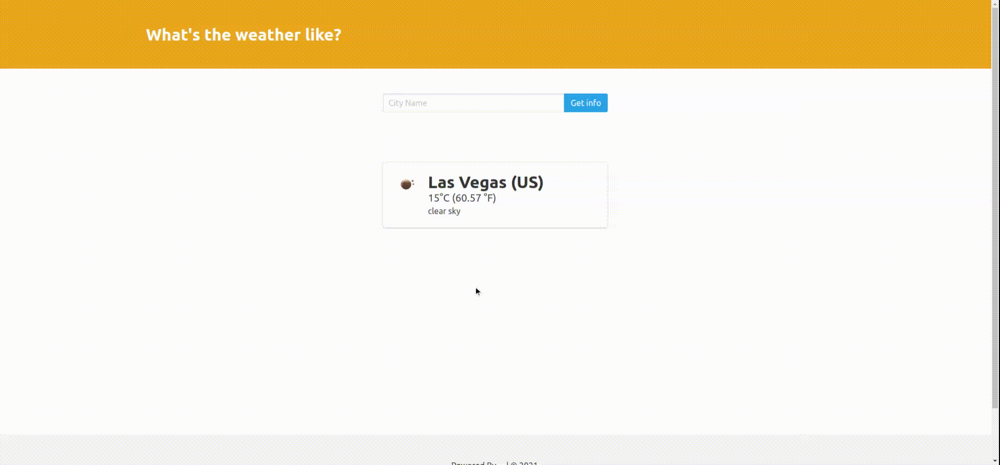

# Django-WeatherApp
A simple weather application that requires to enter a city name and then returns information about the current weather conditions in that city. 
The application was implemented in the django framework and all information is accessed through the api service.

